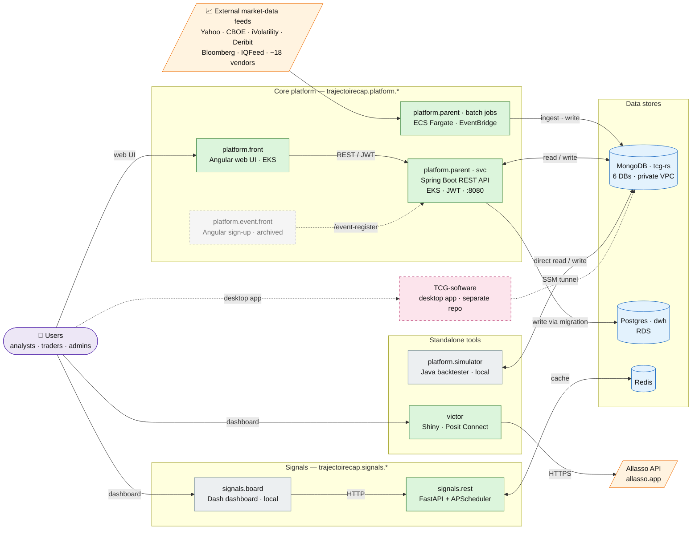

# TCG-documentation

Developer onboarding docs for the Trajectoire CAP (TCG) **production** systems. One folder per prod repo, plus `mongodb/` (cluster contents + connection method) and `sql/` (the `dwh` Postgres warehouse). Target reader: a developer who must start working in these systems with nothing but these docs. Source code lives elsewhere (AWS CodeCommit, `eu-central-1`); this repo is docs only.

## System map at a glance



**Legend** — 🟩 live deployed service · ⬜ local/analyst tool · 🟦 data store · 🟧 external feed/API · 🟪 users · pink dashed = separate project (TCG-software) · faded dashed = archived. Arrows show a few representative flows, **not** every call — see the detailed [System map](#system-map) below for hosts, ports, and exact collections.

## Folder tree

```
TCG-documentation/
├── README.md                              this index
├── trajectoirecap.platform.parent/        central Java backend + all batch jobs
├── trajectoirecap.platform.front/         Angular operator/trader web UI
├── trajectoirecap.platform.event.front/   Angular investor-event sign-up form
├── trajectoirecap.platform.simulator/     Java local backtesting library
├── trajectoirecap.signals.board/          Dash analyst signal dashboard
├── trajectoirecap.signals.rest/           FastAPI signals API (Redis-backed)
├── victor/                                Python Shiny VIX-strategy tracker
├── mongodb/                               Mongo cluster: schemas, readers, ingestion, tunnel
│   ├── structure.md                       6 DBs, ~80 collections, document shapes
│   ├── consumers.md                       who READS which collections
│   ├── ingestion.md                       how each collection gets WRITTEN
│   └── connecting.md                      SSM tunnel + mongosh + Python
└── sql/                                   AWS Postgres `dwh` warehouse (docs TBD)
```

## Index

| Folder | Purpose | Stack | Status | Deploy |
|---|---|---|---|---|
| [trajectoirecap.platform.parent](trajectoirecap.platform.parent/README.md) | Central REST backend (`svc`) + ~18 vendor feeds + risk/PnL/signals batch jobs; sole writer to Postgres `dwh` | Java 17, Spring Boot 2.6.14, Maven (multi-module) | **live** (CodeCommit, recent commits, active ECS/EKS deploy) | EKS (`svc` web app) + ECS Fargate (all batch jobs, EventBridge Scheduler) |
| [trajectoirecap.platform.front](trajectoirecap.platform.front/README.md) | Main operator/trader web UI (P&L, portfolio, ~20 strategy signal monitors, simulator, admin) | TypeScript 4.9, Angular 16, Angular CLI 16 | **live** (consumes prod API, recent strategy commits) | unknown — no deploy config in repo; static bundle, pipeline lives elsewhere (TODO: locate) |
| [trajectoirecap.platform.event.front](trajectoirecap.platform.event.front/README.md) | Single-page investor event (April 2023) registration form | TypeScript 4.9, Angular 15.1, Angular CLI 15.1 | **likely archived/inactive** (hardcoded 2023 content, no deploy config, no code ref from other repos) | unknown — no Dockerfile/buildspec/k8s in repo |
| [trajectoirecap.platform.simulator](trajectoirecap.platform.simulator/README.md) | Local research/backtesting library over `tcg` Mongo prices + options | Java 13, Spring Boot 2.3 (vestigial), Maven (fat JAR) | **local tool** (no Dockerfile/buildspec/scheduler; last commit 2022-09-27; run from IDE) | not deployed (manual IDE/CLI runs) |
| [trajectoirecap.signals.board](trajectoirecap.signals.board/README.md) | Analyst Dash dashboard for live signals + backtests; reads from signals.rest only | Python (3.12 per sibling), Dash 2.18 + Flask 3.0 | **local tool** (no Dockerfile/buildspec/scheduler; last commit 2025-02-11) | not deployed (runs locally, port 8050) |
| [trajectoirecap.signals.rest](trajectoirecap.signals.rest/README.md) | FastAPI signals API; APScheduler jobs populate Redis from `signals.lib`, endpoints read Redis | Python 3.12, FastAPI ≥0.68, Uvicorn, APScheduler 3.11 | **live** (active commits; Dockerfile + docker-compose; consumed by board) | unknown prod runtime — Dockerfile/compose only, no ECS/buildspec committed |
| [victor](victor/README.md) | Python Shiny VIX-strategy tracker + Bloomberg chat parser (12 strategies, 1 implemented) | Python (3.8–3.11), Shiny for Python 1.2 | **live** (`prod` branch, recent commits) | Posit Connect (`allasso.app`); manual `rav deploy` (rsconnect) |
| [mongodb](mongodb/structure.md) | The `tcg-rs` Mongo cluster: 6 DBs (~80 collections), schemas, readers, ingestion jobs, SSM tunnel | MongoDB replica set `tcg-rs` | **live** (prod data store for all platform components) | n/a (managed datastore; reach via SSM tunnel) |
| [sql](sql/README.md) | AWS Postgres `dwh` warehouse | PostgreSQL (RDS) | **live** (datastore); **docs TBD** | n/a (RDS `tcgdwh…eu-central-1.rds.amazonaws.com/dwh`) |

> `bb.svc` (Bloomberg `blpapi` data service) is a parent submodule **excluded from the main Maven reactor**, built/deployed separately on a Bloomberg-licensed host — not a top-level repo here. The `signals.lib` (FastAPI signal strategies) is a **Git submodule** of `signals.rest`, not a documented folder. TCG-software (Python/FastAPI desktop app, owner of Mongo DB `tcg-app-data`) is a separate project, not in this repo.

## System map

Three clusters. **(a)** core platform: two Angular UIs → parent `svc` REST → Mongo (5 DBs R/W) + `dwh` (write via `migration`), with ECS-Fargate feed/compute jobs filling Mongo. **(b)** signals: Dash board → FastAPI rest → Redis. **(c)** isolated tools: `simulator` (direct Mongo) and `victor` (Allasso API only) — neither in the Mongo/`dwh`/ECS pipeline.

```
(a) CORE PLATFORM CLUSTER
  platform.front (Angular 16) ──HTTPS REST──┐  api.platform.trajectoirecap.com   (no hyphen)
  event.front   (Angular 15) ──HTTPS REST──┤  api.platform.trajectoire-cap.com  (hyphenated — different host!)
                                            ▼
                              platform.parent  svc  (Spring Boot, EKS, :8080, JWT, ALB www.aisy.fr)
                                 │  │
                                 │  └── migration module ──WRITE──► Postgres dwh   (ONLY Java writer)
                                 │            (also: signals.trading / signals.report.export / copilot.data ──READ── dwh)
                                 ▼
                       MongoDB tcg-rs  (5 DBs R/W: tcg, tcg-instrument, tcg-raw, tcg-report, tcg-signals)
                                 ▲
        ECS Fargate batch jobs (EventBridge Scheduler, cluster tcg-svc-cluster) ──WRITE──┘
        ~18 vendor feeds (yahoo/cboe/ivolatility/deribit/coingecko/bitstamp/sudrania/edfman/…)
        + compute/signals/export jobs (var/stress/greeks/pnl/black-tail-signals/…)

      event.front  POST /event-register ─► svc ─► Mongo tcg.eventRegister  (unauthenticated)

(b) SIGNALS CLUSTER
  signals.board (Dash, :8050) ──HTTP GET──► signals.rest (FastAPI, :80) ──TCP──► Redis (db0 data, db1 jobs)
                                                   └── loads strategy classes from signals.lib submodule (in-process)

(c) ISOLATED TOOLS
  simulator (Java, local)  ──reads/writes──► MongoDB tcg-rs (tcg, tcg-instrument) + a LOCAL Mongo for vol surfaces
  victor (Shiny, Posit Connect allasso.app)  ──HTTPS──► Allasso API only   (no Mongo / no dwh / not in ECS pipeline)
```

### Who calls / reads / writes what

| Component | Calls (service) | Reads | Writes | Deploy target |
|---|---|---|---|---|
| `platform.front` | parent `svc` REST @ `api.platform.trajectoirecap.com` (prod) / `localhost:8080` (dev); SSE `GET /{strategy}/stream/{token}` | — (browser `localStorage` only) | — | unknown (static bundle; pipeline elsewhere) |
| `event.front` | parent `svc` `POST /event-register` @ `api.platform.trajectoire-cap.com` (unauth) | — | Mongo `tcg.eventRegister` (via `svc`) | unknown (no deploy config) |
| `platform.parent` `svc` | — (is the backend) | Mongo `tcg`,`tcg-instrument`,`tcg-raw`,`tcg-report`,`tcg-signals`; `dwh.data_live.signals_live` (read) | Mongo (5 DBs R/W); `dwh` **write via `migration` only** | EKS (`svc-app`, :8080, ALB `www.aisy.fr`) |
| `platform.parent` batch jobs | each other only via shared Mongo/`dwh`/SQS | external vendor feeds; Mongo; `dwh` | Mongo `tcg`/`tcg-instrument`/`tcg-raw`/`tcg-report`/`tcg-signals`; email/SQS; `dwh` (`migration`) | ECS Fargate (EventBridge Scheduler, `tcg-svc-cluster`) |
| `simulator` | none (pure batch) | Mongo `tcg.future`/`forex`/`option`/`optionExpiry` (prod) | LOCAL Mongo `tcg.*OptionStruct*` (vol surfaces); stdout/files | not deployed (IDE/CLI) |
| `signals.board` | `signals.rest` HTTP `GET /all-categories`, `/strategy/{n}`, `/signal/{n}` (hardcoded `127.0.0.1:80`) | — (`pymongo` declared but **unused in `src/`**) | — | not deployed (local, :8050) |
| `signals.rest` | `signals.lib` submodule (in-process) | Redis db0 (endpoints) | Redis db0 (signal/strategy/contract keys), db1 (APScheduler job store) | unknown prod runtime (Docker only) |
| `victor` | Allasso API @ `allasso.app` (`/api_int/v1/*`, `/api-strategy/backtests/*`) | Allasso API (Parquet/JSON) + local CSV cache | local CSV/txt cache only | Posit Connect `allasso.app` (manual `rav deploy`) |

### Data stores

| Store | Address | Owner / writer | Notes |
|---|---|---|---|
| MongoDB replica set `tcg-rs` | `10.0.5.10` / `10.0.6.10` `:27017` (private VPC) | `platform.parent` owns 5 DBs (`tcg`,`tcg-instrument`,`tcg-raw`,`tcg-report`,`tcg-signals`), R/W | 6th DB `tcg-app-data` owned by TCG-software (Python, separate project), not by these repos. Reach via SSM tunnel through bastion `i-0132f2ba5f7ed8c81` → `localhost:27017`. See [mongodb/connecting.md](mongodb/connecting.md). |
| Postgres `dwh` | RDS `tcgdwh.ckzfuf3f1u8v.eu-central-1.rds.amazonaws.com/dwh` | `platform.parent` `migration` module = sole Java writer | Read by `signals.trading`, `signals.report.export`, `copilot.data`. `dwh.data_live.signals_live` is written by an **external system not in any repo here** (UNKNOWN writer). Docs TBD ([sql/](sql/README.md)). |
| Redis | host `redis:6379` (hardcoded in `signals.rest`) | `signals.rest` APScheduler jobs | db0 = signal/strategy/contract data; db1 = APScheduler job store. Used by signals cluster only. |

## Cross-repo facts & known inconsistencies

- **Two prod API hostnames for the same `svc` backend:** `platform.front` uses `api.platform.trajectoirecap.com` (no hyphen); `event.front` uses `api.platform.trajectoire-cap.com` (hyphenated). Both reach the same EKS `svc`. Confirmed in each repo's `environment*.ts`. (`platform.front`'s `environment.ts` even has the hyphenated variant commented out as the unused alternative.)
- **`signals.rest` declares `pymongo`/`motor`/`psycopg2` but does not use them in its own `app/`** — any Mongo/`dwh` access would be inside the `signals.lib` submodule (not audited here). Treat its Mongo/Postgres usage as UNKNOWN.
- **`dwh.data_live.signals_live` writer is UNKNOWN.** `platform.parent` only SELECTs it; the older Mongo audit guessed the signals Python app, but `signals.board` is not the writer (no DB code) and `signals.rest`'s usage is unconfirmed. Carried forward as open.
- **Input-doc conflict (board ↔ Mongo audit):** [mongodb/consumers.md](mongodb/consumers.md) lists `signals.board` as a `pymongo` reader of `tcg-instrument` + signals, but [trajectoirecap.signals.board/README.md](trajectoirecap.signals.board/README.md) states `pymongo` is an **unused dependency** (zero `MongoClient` usage in `src/`) and all data arrives via `signals.rest`. The repo-level (code-verified) README supersedes the audit-derived note: **board does not touch Mongo.**
- **`sql/` docs are a stub ("Documentation TBD").** The `dwh` facts above come from `platform.parent` and `mongodb/ingestion.md`; the dedicated `dwh` schema doc is not yet written.

## Security note (applies to several repos)

Multiple repos commit **plaintext production secrets** (this docs repo is public; the source repos are private CodeCommit). Documented per-repo as SECURITY TODOs, values never reproduced: Mongo admin URIs (`platform.parent` `mongodb-config.properties` ×5; `simulator` `MongoUtils.java`), `dwh` Postgres passwords (`platform.parent` 4 modules), `svc` JWT/RSA secrets, vendor SFTP/API creds (cboe/sudrania/ivolatility), Quandl key (`simulator`), and the AES key/IV in `platform.front` `environment*.ts`. Kepler's use of AWS Secrets Manager is the intended pattern.
